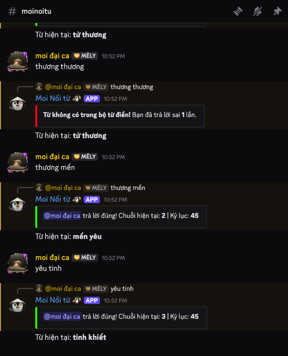
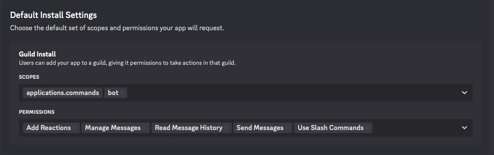
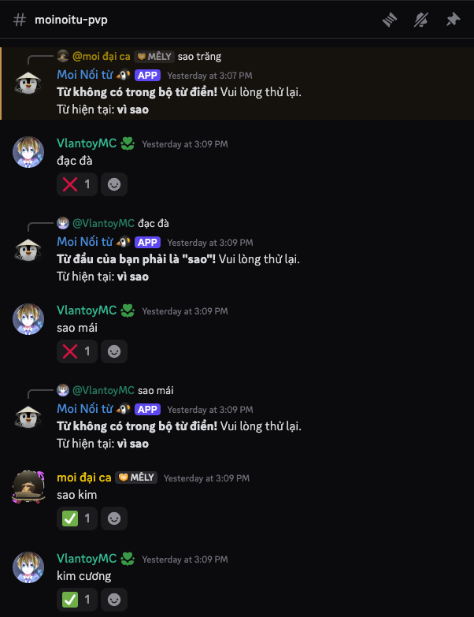
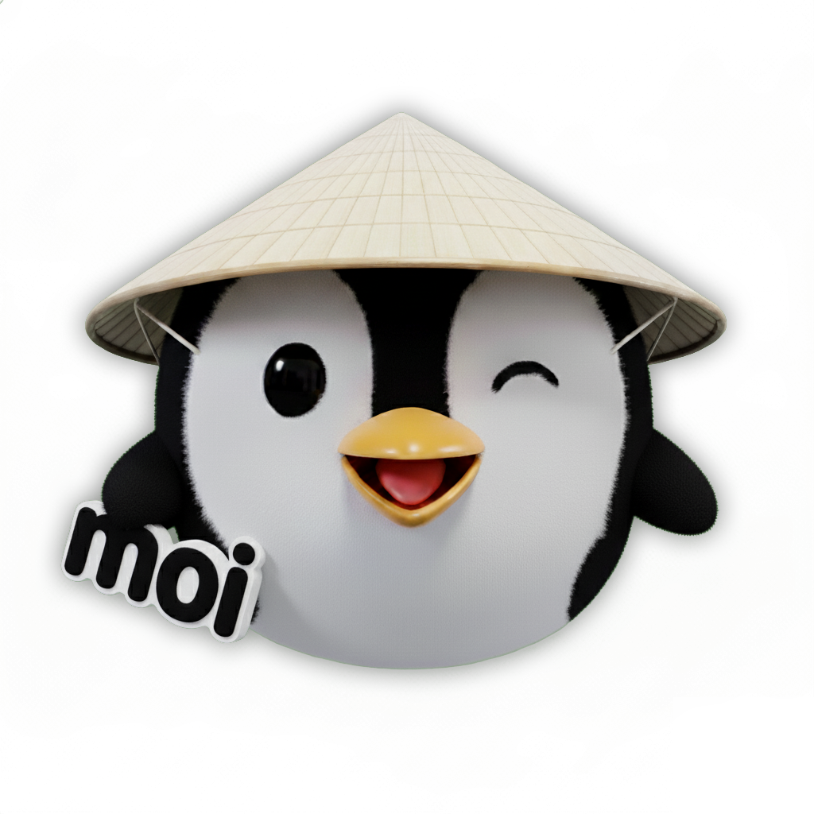

# 🎮 Moi Nối Từ - Discord Bot

<!-- [](https://discord.com/) -->
[](https://discord.com/oauth2/authorize?client_id=1076547168099385436)
[](https://nodejs.org/)
[](LICENSE)

Bot Discord chơi game nối từ tiếng Việt với từ gồm 2 chữ. Hỗ trợ chơi cả trong kênh server và tin nhắn riêng (DM).



## ✨ Tính năng

### 🎯 Game Nối Từ
- **Từ điển tiếng Việt**: Sử dụng bộ từ điển phong phú với gần 60,000 từ ghép
- **2 chế độ chơi**:
  - **Bot vs User**: Bot tự động tìm từ tiếp theo
  - **PvP (User vs User)**: Người chơi thi đấu với nhau
- **DM Support**: Có thể chơi riêng với bot qua tin nhắn trực tiếp
- **Thống kê cá nhân**: Theo dõi chuỗi thắng, kỷ lục, số trận thắng

### 🛠️ Quản Lý Kênh
- **Thêm/Xóa kênh**: Admin có thể thêm kênh để bot hoạt động
- **Chế độ linh hoạt**: Chuyển đổi giữa bot mode và PvP mode
- **Reset game**: Bắt đầu lại từ đầu bất cứ lúc nào

### 📚 Tiện Ích
- **Tra cứu từ điển**: Tích hợp API từ điển tiếng Việt
- **Hỗ trợ nhiều định dạng**: Xử lý dấu tiếng Việt chuẩn

### 👮 Quản Trị Viên
- **Quản lý kênh**: Thêm/xóa kênh, đổi chế độ chơi
- **Logs chi tiết**: Theo dõi hoạt động bot

## 🚀 Cài Đặt

### Yêu cầu hệ thống
- Node.js >= 16.0.0
- npm hoặc yarn
- Discord Bot Token

### Các bước cài đặt

1. **Clone repository**
   ```bash
   git clone https://github.com/minhqnd/noi-tu-discord-bot.git
   cd noi-tu-discord-bot
   ```

2. **Cài đặt dependencies**
   ```bash
   npm install
   ```

3. **Tạo file .env**
   ```env
   DISCORD_BOT_TOKEN=your_bot_token_here
   ```

4. **Khởi chạy bot**
   ```bash
   npm start
   ```

### ⚙️ Cấu Hình Bot Discord

1. Truy cập [Discord Developer Portal](https://discord.com/developers/applications)
2. Tạo ứng dụng mới hoặc chọn ứng dụng hiện có
3. Chuyển đến tab "Bot"
4. Sao chép Bot Token và paste vào file `.env`

#### 🔐 Quyền cần thiết cho Bot
Bot cần các quyền sau trong server:
- ✅ Manage Messages
- ✅ Send Messages
- ✅ Use Slash Commands
- ✅ Read Message History
- ✅ Add Reactions (cho PvP mode)


*Ảnh hướng dẫn cấu hình quyền cho bot*

## 🎮 Cách Chơi

### Cơ Bản
1. **Thêm kênh**: Sử dụng `/noitu_add` để thêm kênh chơi game
2. **Bắt đầu**: Bot sẽ tự động bắt đầu với từ đầu tiên
3. **Nối từ**: Nhập từ gồm 2 chữ bắt đầu bằng chữ cuối của từ trước
4. **Thắng**: Khi đối phương/bot không tìm được từ tiếp theo

### Ví dụ
```
Bot: thế chân
User: chân trời
Bot: trời xanh
User: xanh lục
...
```

### Chế Độ PvP
- Bot chỉ kiểm tra và thả reaction:
  - ✅ Từ đúng
  - ❌ Từ không nối được
  - 🔴 Từ đã lặp
  - ⚠️ Sai format



### Chơi Trong DM
- Gửi tin nhắn trực tiếp cho bot
- Bot sẽ phản hồi và chơi riêng với bạn

## 📋 Commands

### 🎯 Commands Chính
| Command | Mô tả |
|---------|--------|
| `/noitu_add` | Thêm kênh để bot hoạt động |
| `/noitu_remove` | Xóa kênh khỏi game |
| `/newgame` | Bắt đầu game mới |
| `/stats` | Xem thống kê cá nhân |
| `/help` | Hiển thị hướng dẫn |

### 📚 Tiện Ích
| Command | Mô tả |
|---------|--------|
| `/tratu [từ]` | Tra cứu từ điển |
| `/noitu_mode [mode]` | Đổi chế độ chơi |

## 🏗️ Kiến Trúc Code

```
src/
├── discordBot.js      # Bot chính, xử lý Discord events
├── gameEngine.js      # Logic game core
├── gameLogic.js       # Interface giữa bot và game engine
├── db.js             # Database layer (JSON file)
├── utils.js          # Constants và utilities
└── assets/
    └── wordPairs.json # Bộ từ điển (~60,000 từ)
```

### 🗂️ Cấu Trúc Dữ Liệu

**data.json**:
```json
{
  "channels": {
    "channel_id": {
      "word": "từ hiện tại",
      "history": ["từ đã dùng"],
      "players": {
        "user_id": {
          "currentStreak": 5,
          "bestStreak": 12,
          "wins": 3
        }
      },
      "mode": "bot"
    }
  },
  "users": {
    "user_id": {
      "word": "từ hiện tại",
      "history": ["từ đã dùng"],
      "currentStreak": 8,
      "bestStreak": 15,
      "wins": 5
    }
  },
  "channelAllowlist": ["channel_id_1", "channel_id_2"]
}
```

## 🔧 Phát Triển

### Thêm Từ Mới
Từ điển được lưu trong `src/assets/wordPairs.json`. Để thêm từ mới:

Thêm vào file JSON theo format:
   ```json
   {
     "từ_đầu": ["từ_cuối_1", "từ_cuối_2"]
   }
   ```

### Testing
```bash
# Chạy bot ở chế độ development
npm run dev

# Kiểm tra logs
tail -f bot.log
```

## 📊 Thống Kê & Logs

### Logs
Bot ghi log chi tiết vào file `bot.log`:
- Game events (thắng/thua)
- User interactions
- Errors và warnings

### Thống Kê
- **Chuỗi hiện tại**: Số từ nối liên tiếp trong game hiện tại
- **Kỷ lục**: Chuỗi dài nhất từng đạt được
- **Số trận thắng**: Tổng số lần thắng

## 🤝 Đóng Góp

Chúng tôi hoan nghênh mọi đóng góp!

1. Fork project
2. Tạo feature branch (`git checkout -b feature/AmazingFeature`)
3. Commit changes (`git commit -m 'Add some AmazingFeature'`)
4. Push to branch (`git push origin feature/AmazingFeature`)
5. Tạo Pull Request

### 📝 Báo Lỗi & Đề Xuất
- Tạo [GitHub Issue](https://github.com/minhqnd/noi-tu-discord-bot/issues)

## 📄 License

Dự án này được phân phối dưới giấy phép MIT. Xem file `LICENSE` để biết thêm chi tiết.

---

**Made by [minhqnd](https://github.com/minhqnd)** ❤️


