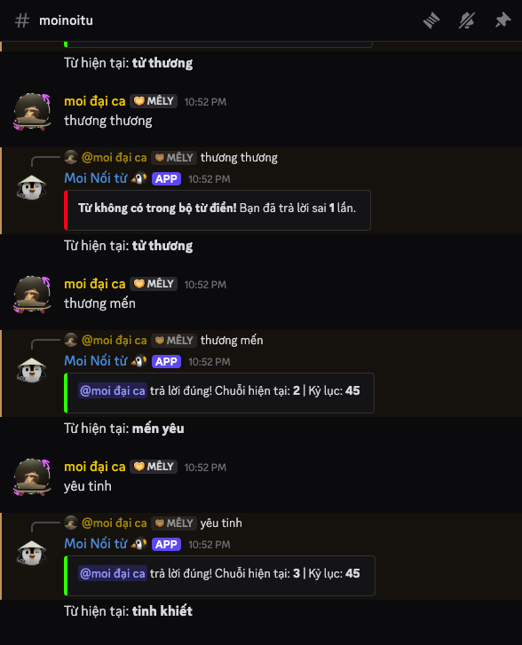
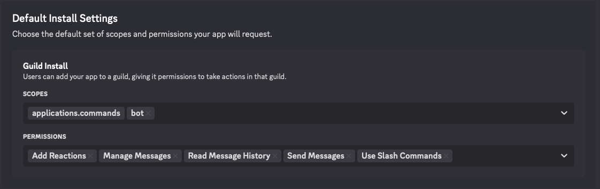
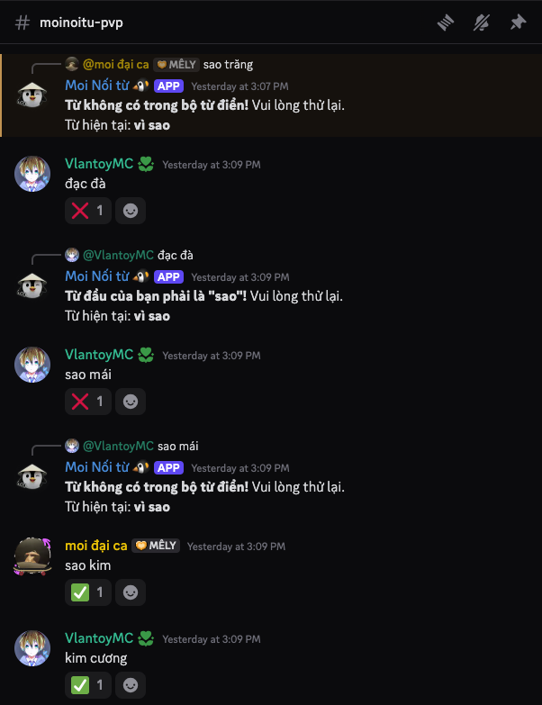
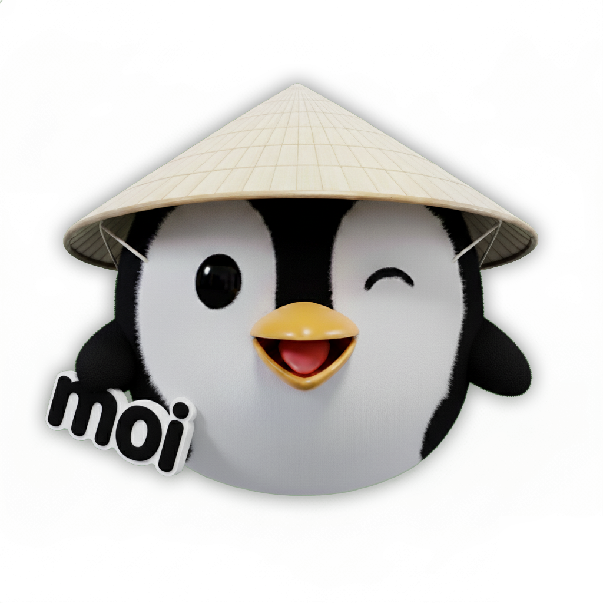

# 🎮 Moi Nối Từ - Discord Bot

<!-- [](https://discord.com/oauth2/authorize?client_id=1076547168099385436)
[](https://discord.com/oauth2/authorize?client_id=1076547168099385436) -->
[](https://nodejs.org/)
[](LICENSE)
[](https://top.gg/bot/1076547168099385436)


### Thêm vào Server ngay!
[](https://discord.com/oauth2/authorize?client_id=1076547168099385436)
>
> ⚡ **3 bước bắt đầu nhanh:**
> 1. Vào kênh muốn chơi, gõ: `/noitu_add` *(yêu cầu quyền Quản lý máy chủ)*
> 2. Chọn chế độ ngay trên menu nút bấm: **Chơi cùng Bot** hoặc **Đấu PvP (Người vs Người)**
> 3. Bắt đầu gõ từ nối tiếp ngay trong kênh!

Bot Discord chơi game nối từ tiếng Việt với từ gồm 2 chữ. Hỗ trợ chơi cả trong kênh server và tin nhắn riêng (DM).



---

## ✨ Tính năng

### 🎯 Game Nối Từ
- **Từ điển tiếng Việt**: Sử dụng bộ từ điển phong phú kết hợp API tra từ với hơn 357,000+ định nghĩa
- **2 chế độ chơi**:
  - **Bot vs User**: Bot tự động tìm từ tiếp theo (thay phiên nhau nối từ)
  - **PvP (User vs User)**: Người chơi trong kênh tự do thi đấu với nhau, Bot làm trọng tài
- **DM Support**: Có thể chơi riêng với bot qua tin nhắn trực tiếp
- **Thống kê cá nhân**: Theo dõi chuỗi thắng, kỷ lục, số trận thắng

### 🛠️ Quản Lý Kênh
- **Thêm/Xóa kênh**: Admin có thể thêm/xóa kênh để bot hoạt động (`/noitu_add`, `/noitu_remove`)
- **Chọn chế độ trực quan**: Bấm nút tương tác để đổi giữa chế độ Bot và PvP (`/noitu_add`, `/noitu_mode`)
- **Reset game**: Bắt đầu lại ván mới bất cứ lúc nào (`/newgame`)

### 📚 Tiện Ích & Phản Hồi
- **Tra cứu từ điển**: Tích hợp API từ điển tiếng Việt (`/tratu [từ]`) qua [dict.minhqnd.com](https://dict.minhqnd.com)
- **Gửi phản hồi (`/feedback`)**: Báo từ thiếu, lỗi hoặc đề xuất tính năng trực tiếp tới admin bot

### 👮 Quản Trị Viên
- **Quản lý kênh**: Thêm/xóa kênh, đổi chế độ chơi
- **Cơ sở dữ liệu SQLite**: Tối ưu hiệu năng, lưu trữ hàng trăm server mượt mà
- **Logs chi tiết**: Theo dõi hoạt động bot

## 🚀 Cài Đặt

### Yêu cầu hệ thống
- Node.js >= 18.0.0
- pnpm / npm / yarn
- Tài khoản Discord Bot Token

### Các bước cài đặt

1. **Clone repository**
   ```bash
   git clone https://github.com/minhqnd/noi-tu-discord-bot.git
   cd noi-tu-discord-bot
   ```

2. **Cài đặt dependencies**
   ```bash
   pnpm install
   ```

3. **Tạo file .env**
   ```env
   DISCORD_BOT_TOKEN=your_bot_token_here
   ```

4. **Khởi chạy bot**
   ```bash
   pnpm start
   ```

### ⚙️ Cấu Hình Bot Discord

1. Truy cập [Discord Developer Portal](https://discord.com/developers/applications)
2. Tạo ứng dụng mới hoặc chọn ứng dụng hiện có
3. Chuyển đến tab "Bot"
4. Sao chép Bot Token và paste vào file `.env`

#### 🔐 Quyền cần thiết cho Bot
Bot cần các quyền sau trong server:
- ✅ Manage Messages
- ✅ Send Messages
- ✅ Use Slash Commands
- ✅ Read Message History
- ✅ Add Reactions (cho PvP mode)

Người dùng cần quyền **Manage Server** để dùng `/noitu_add`, `/noitu_remove` và `/noitu_mode`.


*Ảnh hướng dẫn cấu hình quyền cho bot*

## 🎮 Cách Chơi

### Cơ Bản
1. **Thêm kênh**: Sử dụng `/noitu_add` để thêm kênh chơi game
2. **Bắt đầu**: Bot sẽ tự động bắt đầu với từ đầu tiên
3. **Nối từ**: Nhập từ gồm 2 chữ bắt đầu bằng chữ cuối của từ trước
4. **Thắng**: Khi đối phương/bot không tìm được từ tiếp theo

### Ví dụ
```
Bot: thế chân
User: chân trời
Bot: trời xanh
User: xanh lục
...
```

### Chế Độ PvP
- Bot chỉ kiểm tra và thả reaction:
  - ✅ Từ đúng
  - ❌ Từ không nối được
  - 🔴 Từ đã lặp
  - ⚠️ Sai format



### Chơi Trong DM
- Gửi tin nhắn trực tiếp cho bot
- Bot sẽ phản hồi và chơi riêng với bạn

## 📋 Commands

### 🎯 Commands Chính
| Command | Mô tả |
|---|---|
| `/noitu_add` | Thêm kênh phòng game & hiện menu chọn chế độ qua 2 nút bấm *(Cần quyền Manage Server)* |
| `/noitu_remove` | Xóa kênh khỏi game *(Cần quyền Manage Server)* |
| `/noitu_mode [mode]` | Chọn chế độ chơi: `bot` hoặc `pvp` (hoặc để trống để mở 2 nút bấm chọn) *(Cần quyền Manage Server)* |
| `/newgame` | Bắt đầu ván mới |
| `/stats` | Xem thống kê chuỗi thắng, kỷ lục |
| `/help` | Hiển thị hướng dẫn sử dụng |

### 📚 Tiện Ích & Đóng Góp
| Command | Mô tả |
|---|---|
| `/tratu [từ]` | Tra cứu nghĩa từ điển tiếng Việt qua [dict.minhqnd.com](https://dict.minhqnd.com) |
| `/leaderboard` | Xem bảng xếp hạng người chơi (trong kênh hoặc toàn server) |
| `/botstats` | Xem thống kê toàn hệ thống của Bot Nối Từ |
| `/feedback` | Gửi báo cáo từ còn thiếu, báo lỗi hoặc đề xuất tính năng trực tiếp cho Admin |
| `/addword [word]` | **[OWNER - DM]** Thêm từ mới trực tiếp vào `customWords.json` (hỗ trợ nhiều từ cách nhau bằng dấu phẩy) |

## 🏗️ Kiến Trúc Code

```
src/
├── discordBot.js      # Bot chính, xử lý Discord interactions & messages
├── gameEngine.js      # Logic core game nối từ & tính streak
├── gameLogic.js       # Interface giữa bot và game engine
├── db.js             # Database layer (SQLite better-sqlite3)
├── wordProcessing.js # Xử lý chuẩn hóa từ, merge từ điển & gọi API
├── utils.js          # Constants và logger (Winston)
└── assets/
    ├── wordPairs.json   # Bộ từ điển gốc (mặc định)
    └── customWords.json # Bộ từ điển tùy chỉnh (từ được thêm qua /addword hoặc duyệt feedback)
```

### 🗂️ Cấu Trúc Dữ Liệu (SQLite)

Dữ liệu được lưu trong `data.db` (SQLite WAL mode):
- **`channels`**: Lưu trạng thái ván game hiện tại của từng kênh (`word`, `mode`, `history`, `players`)
- **`users`**: Lưu trạng thái game 1v1 khi chat riêng DM với bot (`word`, `history`, `streaks`, `wins`)
- **`channel_allowlist`**: Danh sách ID các kênh được kích hoạt chơi game nối từ
- **`feedbacks`**: Danh sách các phản hồi, đóng góp từ người dùng gửi qua `/feedback`

## 🔧 Phát Triển & Quản Trị Từ Điển

### Cơ Chế Từ Điển & Thêm Từ Mới

Hệ thống từ điển gồm 2 file trong `src/assets/`:
1. **`wordPairs.json`**: Từ điển gốc cố định của bot.
2. **`customWords.json`**: Từ điển tùy chỉnh. Tất cả các từ mới được thêm thủ công hoặc được admin duyệt từ feedback sẽ được lưu vào file này.

> Khi bot khởi động, hệ thống sẽ tự động gộp (merge) cả hai file vào bộ nhớ (`wordPairs` & `listWords`).

---

#### 1. Thêm từ nhanh qua lệnh `/addword` (Khuyên dùng)
Dành cho **OWNER** trong tin nhắn riêng (DM) với bot:
- Cú pháp: `/addword word: <danh sách từ>`
- Hỗ trợ thêm 1 hoặc nhiều từ cách nhau bằng dấu phẩy (`,`) hoặc xuống dòng.
  ```
  /addword word: khô cá, khô bò, hải tú
  ```
- Bot sẽ tự động chuẩn hóa, kiểm tra 2 âm tiết, lưu vào `src/assets/customWords.json` và cập nhật tức thì vào ván chơi mà **không cần restart bot**.

---

#### 2. Duyệt từ đóng góp từ người chơi (`/feedback`)
Khi người dùng gửi feedback loại **"Từ còn thiếu"**:
- Bot tự động phân tích (auto-parse) các từ hợp lệ (2 âm tiết).
- Gửi thông báo DM cho Admin kèm:
  - **Select Menu**: Hiển thị danh sách từ đã parse, cho phép admin tick chọn / bỏ chọn từng từ muốn duyệt.
  - **Nút `✅ Duyệt từ đã chọn`**: Tự động gọi `addWord()`, lưu vào `customWords.json` và gửi thông báo tổng hợp kèm nút reply cho người chơi.
  - **Nút `📋 Duyệt tổng`**: Gom tất cả các từ pending từ toàn bộ feedback chưa duyệt để duyệt hàng loạt 1 lần.
  - **Nút `❌ Từ chối tất cả`** & **`💬 Trả lời`**: Xử lý phản hồi hoặc trao đổi thêm với người dùng.

---

#### 3. Chỉnh sửa thủ công file `customWords.json`
Bạn cũng có thể thêm trực tiếp vào file `src/assets/customWords.json` theo định dạng:
```json
{
  "từ_đầu": ["từ_cuối_1", "từ_cuối_2"]
}
```
*Lưu ý: Nếu sửa file trực tiếp bằng tay, cần khởi động lại bot để nạp lại dữ liệu vào RAM.*

### Testing
```bash
# Chạy bot ở chế độ development
npm run dev

# Kiểm tra logs
tail -f bot.log
```

## 📊 Thống Kê & Logs

### Logs
Bot ghi log chi tiết vào file `bot.log`:
- Game events (thắng/thua)
- User interactions
- Errors và warnings

### Thống Kê
- **Chuỗi hiện tại**: Số từ nối liên tiếp trong game hiện tại
- **Kỷ lục**: Chuỗi dài nhất từng đạt được
- **Số trận thắng**: Tổng số lần thắng

## 🤝 Đóng Góp

Chúng tôi hoan nghênh mọi đóng góp!

1. Fork project
2. Tạo feature branch (`git checkout -b feature/AmazingFeature`)
3. Commit changes (`git commit -m 'Add some AmazingFeature'`)
4. Push to branch (`git push origin feature/AmazingFeature`)
5. Tạo Pull Request

### 📝 Báo Lỗi & Đề Xuất
- Tạo [GitHub Issue](https://github.com/minhqnd/noi-tu-discord-bot/issues)

## 📄 License

Dự án này được phân phối dưới giấy phép MIT. Xem file `LICENSE` để biết thêm chi tiết.

---

**Made by [minhqnd](https://github.com/minhqnd)** ❤️


